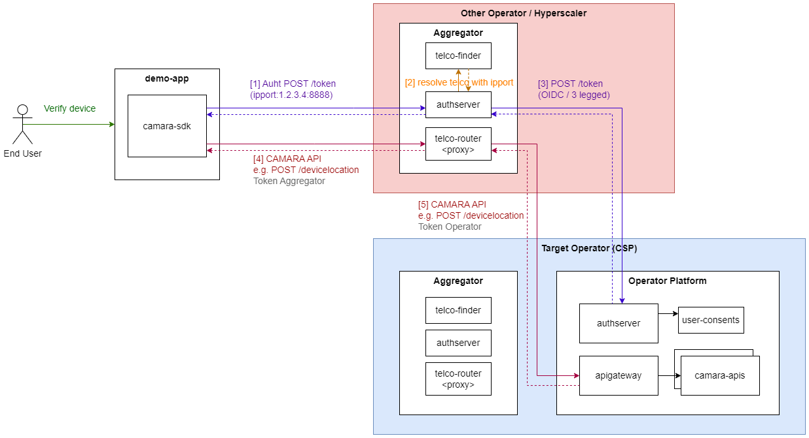

# opengateway-aggregation-poc

Open Gateway proof of concept. It demonstrates how an aggregator (e.g., hyperscaler, operator) can receive requests from an end user / application and forward them to the appropriate operator just using standard OIDC flows and regular CAMARA API calls.

## Demo app

The following diagram represents the flow used in this proof of concept, where an end user wants to use a network capability available in a web demo-app. This app was created by a developer that has a contract with an Aggregator. All the interactions between the demo-app and the aggregator is hidden behind a CAMARA SDK.



1. The demo-app requests an access token to the Aggregator.
2. Using the user identifier (IP and port in this PoC), the Aggregator's authserver queries the Telco Finder to determine which Operator the user belongs to.
3. Once the Telco's authserver knows the Operator, it requests a 3-legged access token from the Operator Platform's authserver.
4. An encrypted access token (JWT) is generated and returned to the demo-app.
5. The demo-app consumes the CAMARA API using the access token. The access token contains routing information, so the Telco Router is able to forward the API call to the Operator Platform's API gateway.
6. The result is returned to the demo-app.

## How to run it

To run the environment, you only need to have Docker installed.

### Aspects to take into account

The authorization code flow demo needs the following modification in your ```/etc/hosts``` file.

You need to add the following resolutions in the hosts file:

```
# authcode demoapp
127.0.0.1       aggregator-telco-router-1
127.0.0.1       aggregator-telco-router-2
127.0.0.1       operator-platform-authserver-1
127.0.0.1       operator-platform-authserver-2
```

### Create the environment

Execute the following command (Docker is required):

```sh
docker-compose up --build
```

That starts a demo app and **two aggregators**:
1. Telefónica
2. Vodafone acting as aggregator for the developer. This means that it is the only point of contact for the app.

Now you can open the **demo-app** at http://localhost:3000 and simulate an app that calls the Device Location Verification API for end users that are Telefónica or Vodafone customers.

# TODO

- Add consent gathering support (already implemented and in production since MWC 2023)
- Evolve Telco Finder to implement [standard webfinger protocol](https://www.rfc-editor.org/rfc/rfc7033#section-3.1).
- Add Administration API to provision apps (already implemented and in production since MWC 2023)
- Add credentials management based on private_key_jwt.
- ...

# License

Copyright 2023 Telefonica Investigación y Desarrollo, S.A.U

Licensed under the Apache License, Version 2.0 (the "License"); you may not use this file except in compliance with the License. You may obtain a copy of the License at

http://www.apache.org/licenses/LICENSE-2.0

Unless required by applicable law or agreed to in writing, software distributed under the License is distributed on an "AS IS" BASIS, WITHOUT WARRANTIES OR CONDITIONS OF ANY KIND, either express or implied. See the License for the specific language governing permissions and limitations under the License.
