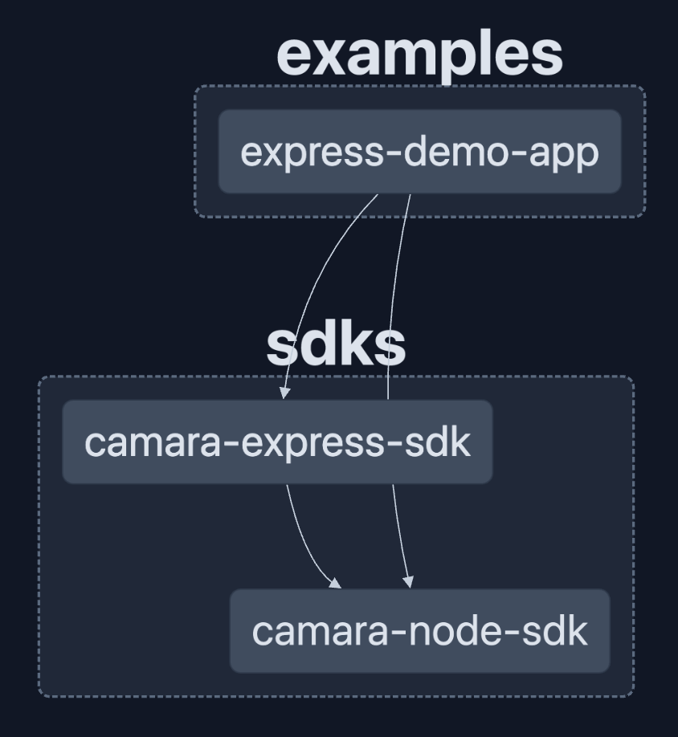

# Camara SDKs

## Introduction

This repository folder contains a monorepo project for the Opengateway Aggregation POC SDKs that allow developers to integrate their Node JS application in an easy way to the Opengateway Aggregation Platform.

## Components

### Architecture diagram



### SDKs
This package contains two different SDKs.

1. ```sdks\camara-node-sdk``` is a SDK that helps the developer to handle JwtBearer and Authorization Code Flows without taking into account any NodeJS framewroks. This SDK is agnostic of frameworks such as Express JS, KoaJs, Sails.js, etc...
Click in the link below to review the API reference of this SDK: [camara-node-sdk Reference](sdks/camara-node-sdk/README.md).
2. ```sdks\camara-express-sdk```is a SDK for the authorization code flow prepared for the Express JS framework. This SDK only contains the authorization code flow because is a flow highly dependant of how are you going to manage the endpoints, session, etc... This sdk depends on ```sdks\camara-node-sdk```.
Click in the link below to review the API reference of this SDK: [camara-express-sdk Reference](sdks/camara-express-sdk/README.md).

### Examples
This package contains only one demo application. This ```examples\express-demo-app``` uses Express JS as main framework. The application expose a Website that helps the user to consume Camara APIs using the JwtBearer and Authorization Code Flows.
Click in the link below if you want to see more information about this demo-app: [demo-app Information](examples/express-demo-app/README.md).


## Contributing

In order to work with Camara SDKs, you need the following technologies:
* *NodeJs 18.x*
* *[PNPM](https://pnpm.io/installation)* Improved Package Manager (Current version 8.5.1. To avoid problems in Jenkins use this version)
* *Docker*

### Other Technologies used in this project

#### Usage of [Nx](https://nx.dev/)
Nx is a build system tool that is used by this project internally to handle the livecycle of the code in the following terms:
* Dependency Analysis and detection
* Task Orchestration
* Caching task results
* Monorepo dependency graph visualization
* Task parallelization

In summary, Nx technology provide us the neccesary workflow tools to handle the livecycle a monorepository with a big complexity.
You can see several usages of Nx in the `package.json` of this repository, but Nx provides us a lot of options. You can see more information about the Nx Cli Commands [here](https://nx.dev/reference/commands).


### Useful commands to begin to work

To work with lambdas in a local environment, the usual practice is to work using unit tests because today we do not have a base that allows a local execution of the lambda. Therefore we work as follows:

Install dependencies:
```sh
pnpm install
```

See dependency graph:
```sh
pnpm run graph
```

Build SDKs with other module types (CommonJs and Es2022):
```sh
pnpm run build:all
```

Start Express Demo Application in development mode:
```sh
pnpm run demoApp:start:dev
```

Start Express Demo Application in production mode:
```sh
pnpm run demoApp:start:pro
```
