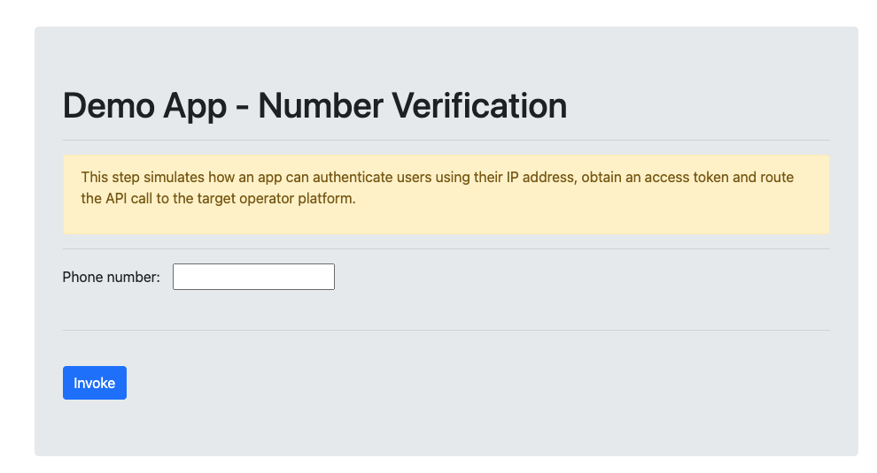
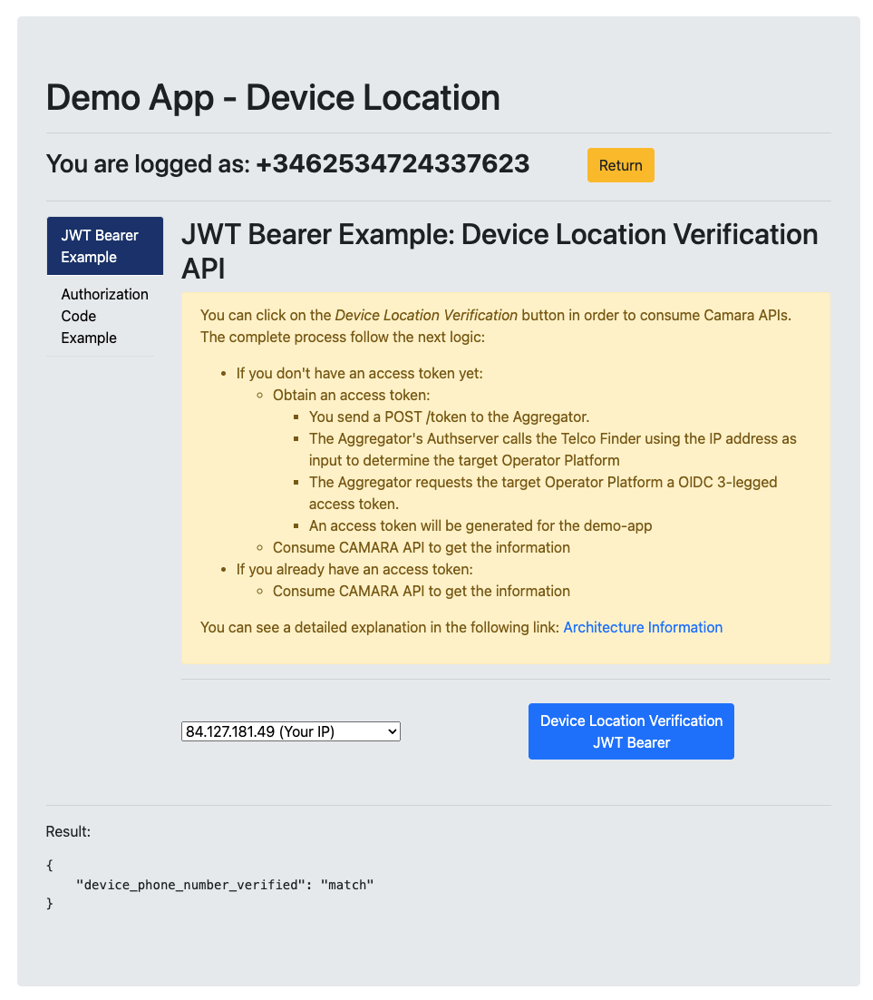
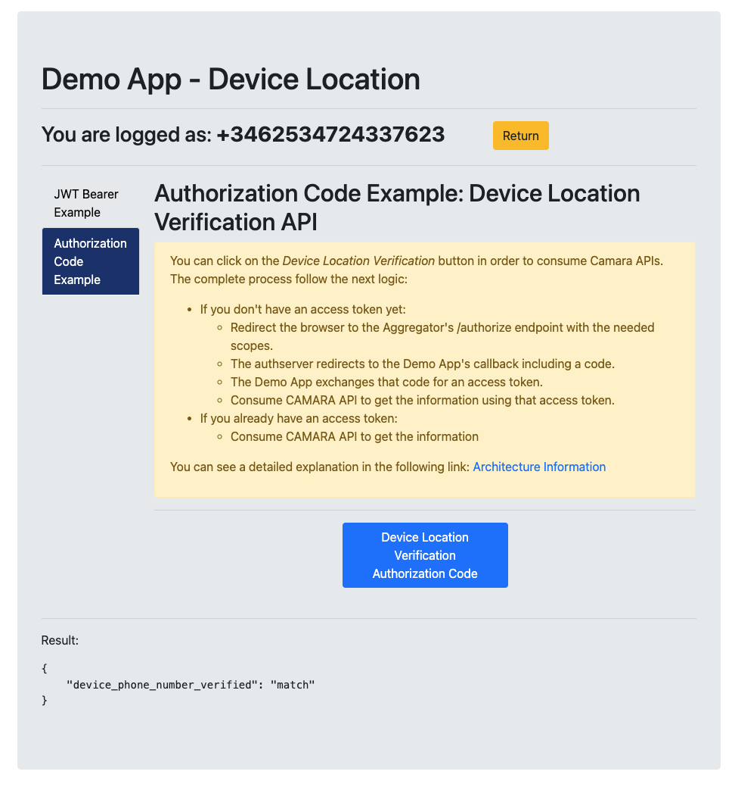

# Express Demo App

This is a simple Demo Application for the Opengateway Aggregation POC. It has integrated two Oauth2 flows and consumes two different CAMARA APIs.

The Demo Application shows two Web pages. The main pages shows a form that perform a Number Verification API consumption using the authorization code flow. There is a phonenumber by default in case you not fill the input text.

The second page is divided in the following three parts:
1. First Tab: You can consume the Device Location Verification API using JwtBearer Flow.
2. Second Tab: You can consume the Device Location Verification API using Authorization Code Flow.
3. Result container: It shows the JSON result of the different CAMA API consumptions.

 
